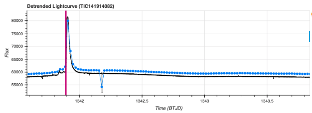
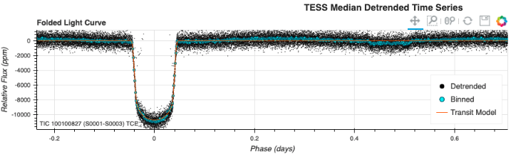
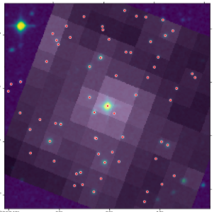

# Science Examples
These tutorials are specific to a particular science case and show how to use the MAST programmatic inerface and the AWS science platform to do research. 

### [Explore Stellar Flare and Variable star light curves.](../notebooks/MAST/TESS/interm_tasc_lc/interm_tasc_lc.ipynb)
This notebook demostrates MAST's programmatic tools for accessing TESS time series data while exploring a flaring star from the literature and a nearby variable star.

### [Exoplanet Properites from Exo.MAST](../notebooks/MAST/TESS/beginner_tess_exomast/beginner_tess_exomast.html) 
This notebook uses python requests to get down planet parameters and plot the TESS detrended light curve for the transiting planet WASP-18.

### [Overlay Sloan Digital Sky Survey Image](../notebooks/MAST/TESS/interm_tesscut_dss_overlay/tesscut_dss_overlay.ipynb). 
Overlay a high resolution image onto a TESS image. Also use k2flix to making a movie of the target pixel file.

- astropy BLS: A planet search of the TESS FFI data
- Ruling out common systematic noise sources. [TESS]() | [Kepler]()
- Kepler planet search and occurrence rates
